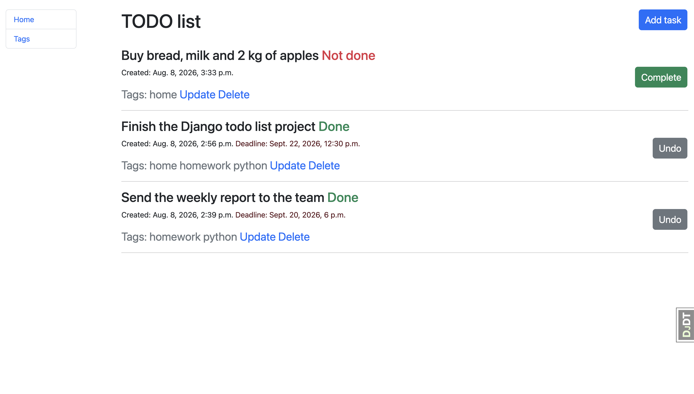
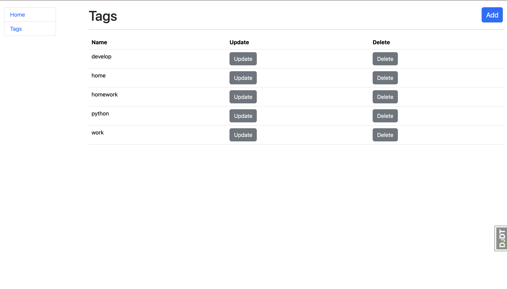

# Todo list project
Todo List web application that allows users to manage tasks and tags, featuring task completion toggles, custom deadlines, and dual-criteria sorting.

## Screenshots of the web application




## Features
1. Implemented full CRUD functionality for the following models:
   - Task
   - Tag
2. Task Status Toggle:
   A button to switch the task state between **Complete** and **Undo**.
3. Task Sorting:
   Tasks are ordered primarily by completion status (active first), and then by creation date (newest first).

## Technology stack
   - Python 3.12
   - Django 6.0
   - Bootstrap 5
   - SQLite
   - crispy-forms
   - django-select2
   - django-debug-toolbar

## Installation and launch

```bash
git clone https://github.com/rinotokun/Todo-List-project.git
cd Todo-List-project
python -m venv venv
source venv/bin/activate # macOS
# venv\Scripts\activate # Windows
pip install -r requirements.txt
cp .env.sample .env
# Open .env and add your secret key and DEBUG status
python manage.py migrate
python manage.py runserver
```

## Tests
Tests can be run with the command `python manage.py test`.
Tests cover models, views and forms.
